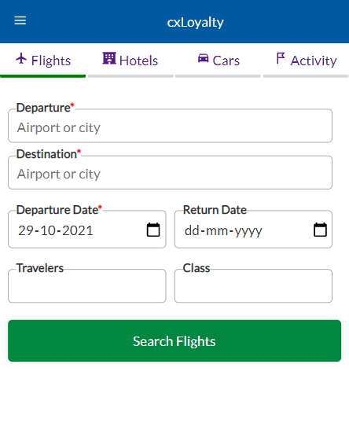
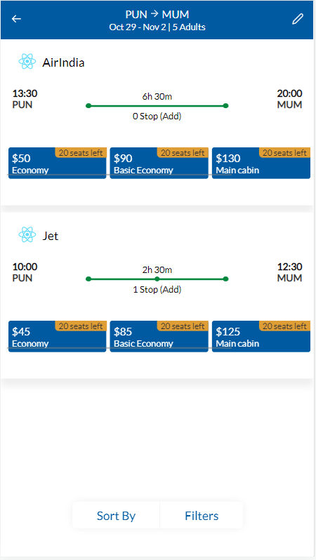
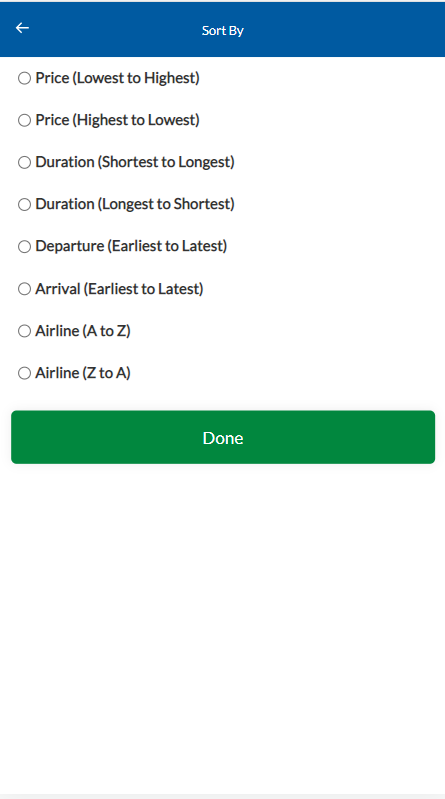
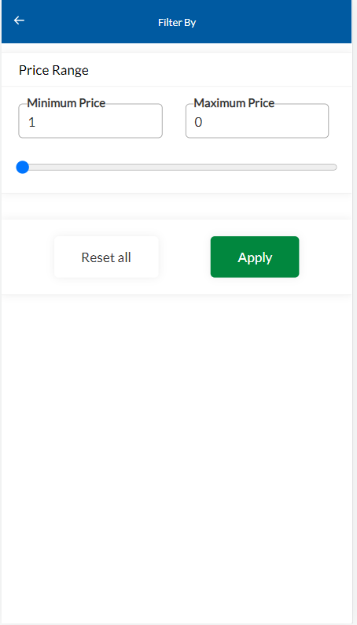

# Getting Started - POC flight booking web app

## How it looks ?

| Home Page                       |    Search Page                    |
|---------------------------------|-----------------------------------|
|  |  |

|           Sort Screen           |        Filter Screen                    |
|---------------------------------|-----------------------------------------|
|  |  |

## Available Scripts

In the project directory, you can run:

### `npm start`

Runs the app in the development mode.\
Open [http://localhost:3000](http://localhost:3000) to view it in the browser.

The page will reload if you make edits.\
You will also see any lint errors in the console.

### `npm test`

Launches the test runner in the interactive watch mode.\
See the section about [running tests](https://facebook.github.io/create-react-app/docs/running-tests) for more information.

### `Tech Used`
1. ReactJS.
2. Redux.
3. React Router.
4. React testing lib.
5. TypeScript.
6. SCSS.